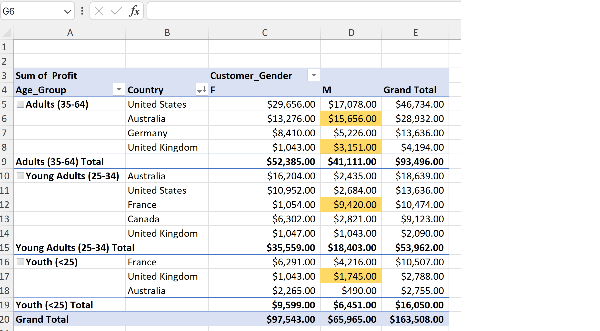
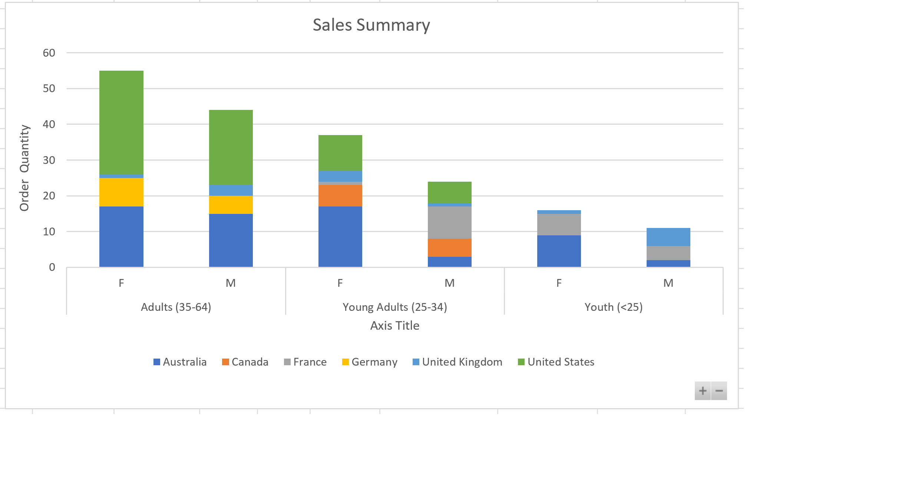
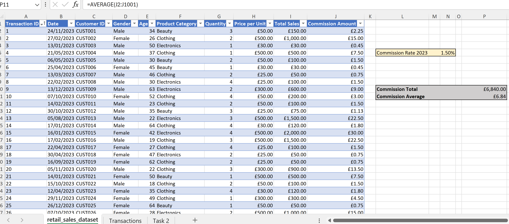
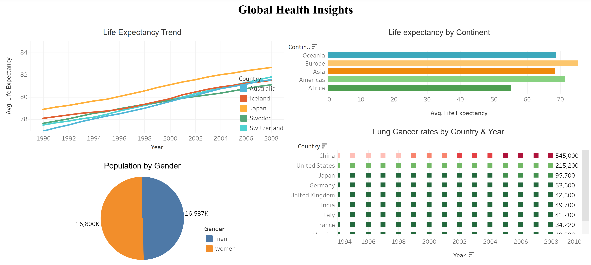
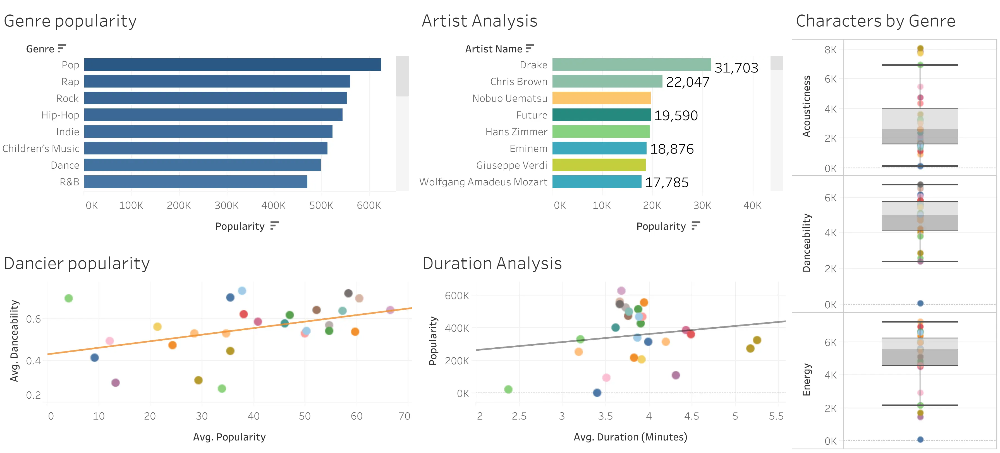
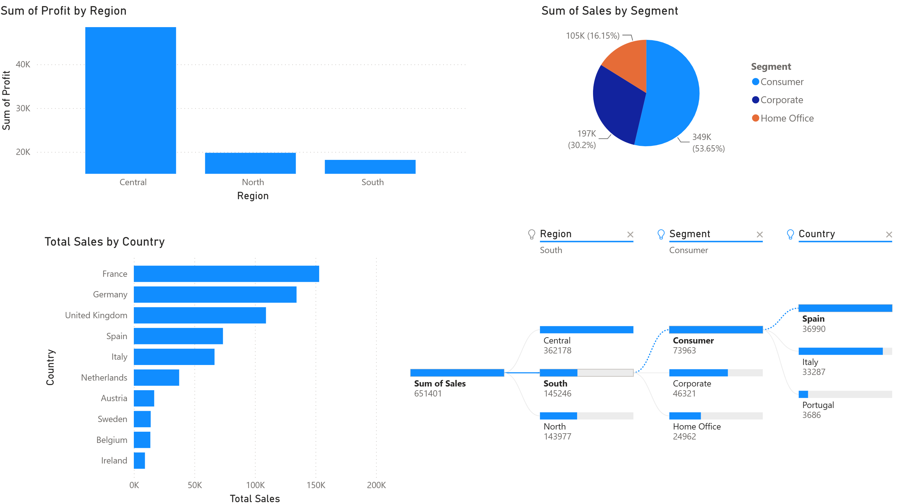
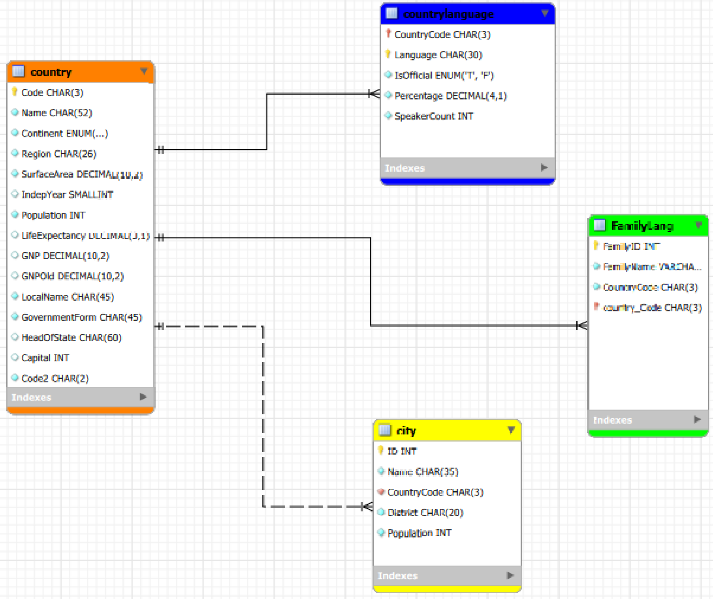

# Hi, I'm Anu. Welcome to My GitHub Portfolio 👋

This repository showcases my learning journey in data analytics and programming. Here you'll find projects I've built using Python, SQL, Power BI, Tableau, and other tools I'm exploring as I strengthen my skills in data analysis and visualisation. I’m continuously updating this space with new exercises, dashboards, and code as I progress.

## 📘 What I Have Learnt

### 🧮 Excel & Data Basics  
I learnt to use basic and advanced Excel features, formulas, and functions to clean, analyse, and organise data effectively.

### 📊 Tableau & Power BI Dashboards  
I learnt the key features and functions of Tableau and Power BI, and how to create interactive visualisations and dashboards for data‑driven insights.

### 🗄️ SQL & MySQL Workbench  
I learnt essential database concepts, SQL syntax, and how to perform data manipulation, filtering, and querying using MySQL Workbench.

### ☁️ Azure Cloud Computing  
I learnt the fundamentals of cloud computing, including IaaS, PaaS, SaaS, major cloud providers, data protection legislation, and features of Azure services such as Blob Storage, Data Lake, File Storage, Table Storage, and Cosmos DB.

### 🐍 Python & Google Colab  
I learnt the purpose and advantages of Python, how algorithms impact data processing, and how to use libraries like Pandas, NumPy, Matplotlib, and Seaborn along with comparison operators, conditional statements, and loops.

## 📂 Projects I Have Completed

---

### 🧮 Excel Project
**Overview**

**Bike Sales Analysis:** 
Analysed bike purchase revenue across age groups using Excel formulas, pivot tables, and charts to uncover customer trends and business insights.

**Retail Sales Analysis:** 

Conducted a retail sales analysis using Excel formulas such as SUM, AVERAGE, and VLOOKUP to compute revenue metrics, identify product performance patterns, and merge lookup data for deeper insights into sales trends.

[📄 Click here to view detailed Excel Project](excel_project.md)

---

### 📊 Tableau Dashboard
**Overview**

I have completed following two projects where I have used Interactive dashboards for visualising KPIs, trends, and patterns using real‑world datasets.

**Global Health Insights**
Analysed global health indicators using multiple Tableau visualisations, including:
- Line Chart – Life expectancy trends across countries  
- Horizontal Bar Chart – Life expectancy by continent  
- Pie Chart – Population distribution by gender  
- Heat Map – Lung cancer rates by country and year  

[📄 Click here to view Global Health Insights interactive Dashboard](https://public.tableau.com/views/GlobalHealthInsights_17806610205890/Dashboard1?:language=en-US&:sid=&:redirect=auth&:display_count=n&:origin=viz_share_link)

**Spotify Music Features**  
Explored music popularity and audio characteristics using:
- Horizontal Bar Charts – Genre popularity and artist rankings  
- Box Plots – Acousticness, danceability, and energy distributions  
- Scatter Plots – Danceability vs popularity and duration vs popularity (with trend lines)

[📄 Click here to view Spotify features interactive Dashboard](https://public.tableau.com/views/SpotifyFeatures_17803963772710/Dashboard1?:language=en-US&:sid=&:redirect=auth&:display_count=n&:origin=viz_share_link)

---

### 📈 Power BI Report

**Overview**  
Built an interactive Power BI dashboard using DAX measures and data modelling to analyse regional performance, customer segments, and country‑level sales insights.

**Visualisations Included**
- Bar Chart – Profit by Region  
- Pie Chart – Sales by Segment  
- Horizontal Bar Chart – Total Sales by Country  
- Flow / Decomposition Tree – Sales breakdown by Region, Segment, and Country

[📄 Click here to view Retail Sales interactive dashboard](https://app.powerbi.com/links/HZeR7w37ij?ctid=3ea7c128-c601-4479-a003-e14d00c0b5cb&pbi_source=linkShare)

[📄 View Power BI Report](powerbi_project.md)

---

### 🗄️ SQL Project

**World Data Analysis**

This project focuses on designing a clear and structured Entity‑Relationship Diagram (ERD) for a relational database.
The ERD demonstrates core database modelling concepts including entity identification, primary keys, foreign keys, and one‑to‑many relationships.

Analysed the MySQL World database using 19 structured SQL queries to explore cities, countries, populations, GDP, life expectancy, and demographic patterns. This project demonstrates core SQL skills including filtering, sorting, joins, grouping, aggregate functions, subqueries, pattern matching, and data extraction.

[📄 Click here to view World Data Analysis Project](SQL_project.md)

---

### ☁️ Azure Cloud Project
[📄 View Azure Project](azure_project.md)

**Description:**  
Hands‑on cloud exercises using Blob Storage, Data Lake, File Storage, Table Storage, and Cosmos DB.

---

### 🐍 Python Project
[📄 View Python Project](python_project.md)

**Description:**  
Data processing and visualisation using Pandas, NumPy, Matplotlib, and Seaborn.
