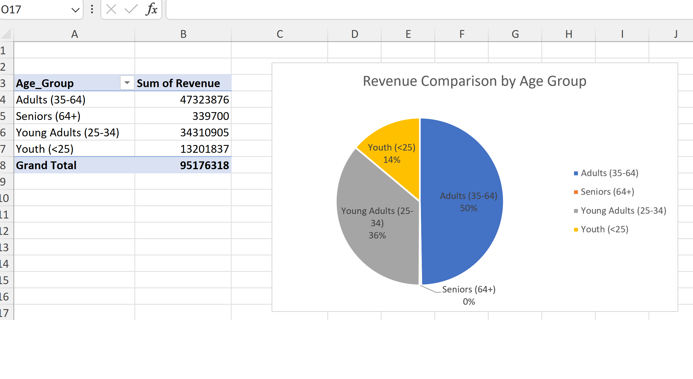
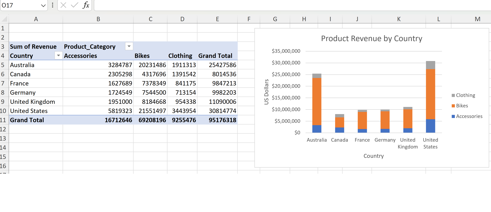
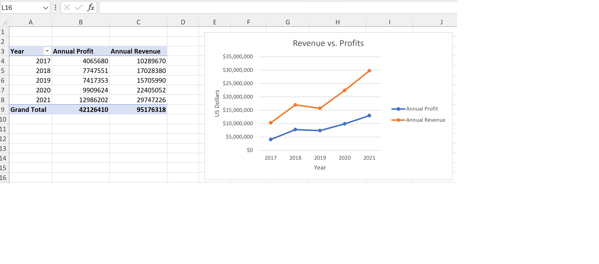
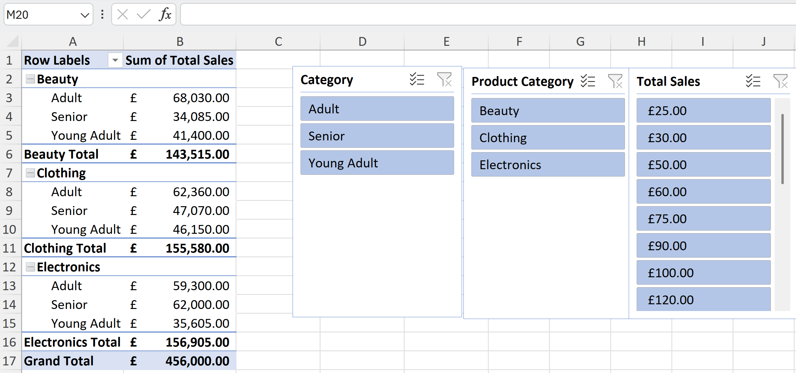
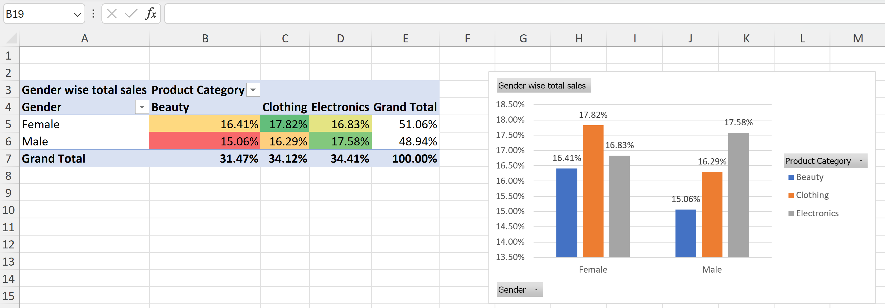
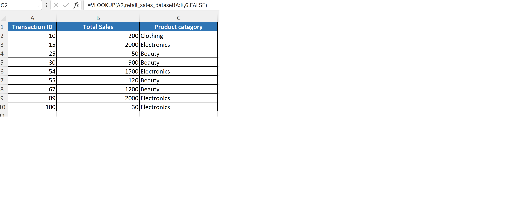

### ▦ Excel Project

## Bike Sales Analysis

**1️⃣ Bike Sales Analysis**

This Excel project analyses bike purchase revenue across different age groups to identify customer trends and business insights.

---

#### 📂 Project Objectives
- Clean and prepare raw sales data  
- Categorise customers into age groups  
- Analyse revenue contribution by each group  
- Build pivot tables and charts for visual insights  
- Summarise findings for business decision‑making  

---

#### 🔧 Tools & Techniques Used
- Excel formulas (SUMIF, COUNTIF, VLOOKUP)  
- Pivot Tables & Pivot Charts  
- Data cleaning (duplicates, formatting, validation)  
- Conditional formatting  
- Age group segmentation  

---

#### 📊 Key Insights
- Identified which age groups generate the highest revenue  
- Highlighted purchasing patterns across demographics  
- Revealed opportunities for targeted marketing  
- Visualised revenue distribution using charts  

---

## 📊 Additional Visuals & Dashboards

Below are all supporting charts created during the Excel analysis.

- ### Bike Sales by Age group

- ### Age Group Revenue Chart

- ### Sales Summary

- ### Revenue by Country

- ### Revenue & Profit by year

🔹🔹🔹🔹🔹🔹🔹🔹🔹🔹🔹🔹🔹🔹🔹🔹🔹🔹🔹🔹🔹🔹🔹🔹🔹🔹🔹🔹🔹🔹🔹🔹🔹🔹🔹🔹🔹🔹

**2️⃣ Retail Sales Analysis**

This Excel project analyses retail transactions to understand sales performance, commission earnings, product category trends, and demographic insights.

---

## 📁 Project Objectives
- Clean and prepare raw retail transaction data  
- Calculate total sales and commission amounts  
- Summarise sales by product category using Pivot Tables  
- Analyse gender‑wise sales distribution  
- Use lookup functions to retrieve product details  
- Build charts to visualise sales patterns  
- Present insights for business decision‑making  

---

## 🛠 Tools & Techniques Used
- Excel formulas (AVERAGE, MAX, VLOOKUP)  
- Pivot Tables & Pivot Charts  
- Data cleaning (duplicates, formatting, validation)  
- Conditional formatting  
- Percentage contribution analysis  
- Lookup functions for category mapping  

---

## 💷 Commission Analysis
Calculated commission amounts using the 2023 commission rate (1.50%) and summarised:
- Total commission  
- Average commission  
- Commission per transaction  

---

## 🛍 Product Category Sales (Pivot Table)
Created a Pivot Table to summarise total sales across product categories.

### ✔ Key Insights
- Electronics generated the highest total sales  
- Clothing and Beauty categories performed consistently  
- Grand Total provides a full view of business revenue  

---

## 👩‍🦰👨 Gender‑Wise Sales Analysis
Analysed sales distribution by gender across Beauty, Clothing and Electronics.

### ✔ Key Insights
- Female customers contributed slightly more to total sales  
- Sales distribution across categories is balanced  
- Useful for demographic‑based marketing strategies  
 

---

## 🔍 VLOOKUP – Product Category Lookup
Used VLOOKUP to retrieve product category based on Transaction ID.

### ✔ What This Shows
- Efficient mapping of product categories  
- Clean summary table of Transaction ID, Total Sales and Category  
- Demonstrates lookup skills for dataset linking  
 

---

## 📝 Summary
This retail sales project demonstrates how Excel can be used to transform raw transactional data into meaningful insights. Through commission calculations, Pivot Tables, demographic analysis and lookup functions, the project provides clear visualisations that support business strategy and decision‑making.
